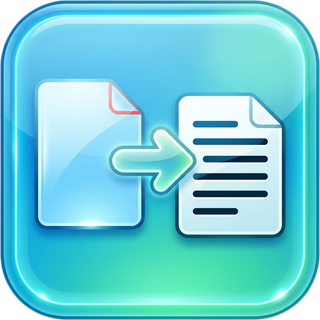

# PDF To Plain Text

<p align="center">
  
</p>

Lightweight, cross-platform desktop utility that converts PDF documents into raw plain text. Drag-and-drop batch processing, persistent output folder, and asynchronous extraction with a real-time progress bar.

Built with **C++17 / Qt 6 / Poppler-Qt6 / CMake** using GCC / MinGW-w64 / Clang.

---

## What it does

- **Frictionless Input** — drop zone accepts single or multiple PDFs, or click to browse.
- **Persistent Workflow** — output folder is remembered via `QSettings`.
- **Asynchronous Performance** — extraction runs in a dedicated `QThread`; UI stays responsive.
- **Pure Text Output** — `Poppler::Page::text()` strips images, graphics, and formatting; writes UTF-8 `.txt` files named after the source PDF.

---

## Prerequisites — get these your preferred way

You need four things. **How** you install them is up to you — pick your preferred package manager. Examples below are common options.

| Need | What to get | Example ways to get it |
|------|-------------|------------------------|
| **CMake >= 3.21** | CMake CLI | `cmake.org` installer, `brew install cmake`, `sudo apt install cmake`, MSYS2 `pacman -S mingw-w64-x86_64-cmake` |
| **C++ compiler** | GCC / MinGW-w64 / Clang | MSYS2 `pacman -S mingw-w64-x86_64-gcc`, `sudo apt install build-essential g++`, `brew install gcc`, `clang` from LLVM |
| **Qt 6.2+ (Widgets + Concurrent)** | Qt SDK | MSYS2 `pacman -S mingw-w64-x86_64-qt6-base mingw-w64-x86_64-qt6-tools`, `aqtinstall`, `sudo apt install qt6-base-dev`, `brew install qt@6` |
| **Poppler-Qt6** | Poppler with Qt6 bindings | MSYS2 `pacman -S mingw-w64-x86_64-poppler-qt6`, `sudo apt install libpoppler-qt6-dev`, `vcpkg install poppler[qt]:x64-mingw-dynamic`. **On macOS, see the note below** |

> After you install them, **note where they landed** — you will point CMake at those locations in the next section. You do not need to copy DLLs manually; the build automates `windeployqt` + runtime DLL deployment so `build/PDFToPlainText.exe` runs immediately without editing `PATH`.

The repository also ships a `vcpkg.json` manifest so `vcpkg` with the MinGW triplet can fetch Poppler automatically. Note the vcpkg feature is called **`qt`**, not `qt6` — `vcpkg install poppler[qt]:x64-mingw-dynamic`.

> **macOS: you must build Poppler yourself.** `brew install poppler` cannot work here — Homebrew's formula hardcodes `-DENABLE_QT6=OFF`, so it ships no `poppler-qt6.pc` and no Qt6 headers. See [Build Poppler on macOS](#build-poppler-on-macos).

---

## Build — point CMake at what you installed

All commands below are run **from the repository root** (the folder containing `CMakeLists.txt`) unless noted otherwise.

### 1) Tell CMake where Qt and Poppler are

You only need this if they are not on a system path. Pick the variable that matches your install:

- **Qt in a custom path** (e.g. `C:\Qt\6.8.2\mingw_64` or `C:\msys64\mingw64` or `~/Qt/6.8.2/gcc_64`): pass `-DCMAKE_PREFIX_PATH="<your-qt-path>"`.
- **Poppler via vcpkg (MinGW)**: pass `-DCMAKE_TOOLCHAIN_FILE="<your-vcpkg>/scripts/buildsystems/vcpkg.cmake"` and `-DVCPKG_TARGET_TRIPLET=x64-mingw-dynamic`.

If you installed both via a system package manager (`apt`/`brew`/`pacman` in MSYS2) you can skip both flags — `find_package` and `pkg-config` find them automatically.

### 2) Configure and build

#### Windows (PowerShell only)

**Guaranteed one-click (recommended):**
```powershell
# From: <repo-root>\  (where CMakeLists.txt lives)
powershell -ExecutionPolicy Bypass -File .\build.ps1 -Clean
# - auto-detects Qt/Poppler at C:\tools\msys64\ucrt64, C:\msys64\ucrt64, or C:\Qt\...\mingw_64
# - sets PATH/PKG_CONFIG_PATH, configures, builds, runs windeployqt, creates packages\*.zip
# - then run: .\build\PDFToPlainText.exe  (no PATH needed, DLLs already copied)
```

**Manual (if you prefer plain cmake):**
```powershell
# From: <repo-root>\  (where CMakeLists.txt lives)

# Example A — MSYS2 UCRT64 via PowerShell:
$env:PATH = "C:\tools\msys64\ucrt64\bin;$env:PATH"  # needed for moc.exe at build time (build.ps1 does this automatically)
$env:PKG_CONFIG_PATH = "C:\tools\msys64\ucrt64\lib\pkgconfig"
cmake -S . -B build -G Ninja -DCMAKE_BUILD_TYPE=Release -DCMAKE_PREFIX_PATH="C:/tools/msys64/ucrt64"
cmake --build build --parallel
.\build\PDFToPlainText.exe   # From: <repo-root>\  — build dir is self-contained via automatic windeployqt

# Example B — Qt via aqtinstall + Poppler via vcpkg (MinGW triplet):
# cmake -S . -B build -G Ninja -DCMAKE_BUILD_TYPE=Release `
#   -DCMAKE_PREFIX_PATH="C:\Qt\6.8.2\mingw_64" `
#   -DCMAKE_TOOLCHAIN_FILE="C:\vcpkg\scripts\buildsystems\vcpkg.cmake" `
#   -DVCPKG_TARGET_TRIPLET=x64-mingw-dynamic
# cmake --build build --parallel
```

> Do **not** use `cmd.exe`. Run PowerShell or the MSYS2 `MINGW64` shell. `build.ps1` fully automates PATH + build + `windeployqt`; manual PowerShell needs the one-time `$env:PATH` line above for `moc.exe` at build time. After `cmake --build`, `build/PDFToPlainText.exe` and `packages/*.zip` are self-contained — no `PATH` or DLL copying needed at runtime.

> **Keep your MinGW variant consistent.** MSYS2 ships two incompatible ABIs — `ucrt64` and `mingw64`. Qt and Poppler must both come from the same one. Mixing them (e.g. `ucrt64` Qt with `mingw64` GCC) fails at link time with undefined C++ runtime symbols. MSYS2's `MINGW64` shell uses `mingw64`; if you use `ucrt64` (as `build.ps1` detects), build from a `ucrt64` shell or set `PATH`/`PKG_CONFIG_PATH` to the `ucrt64` prefix exactly as shown above.

If you prefer the MSYS2 shell directly:

```bash
# From: <repo-root>/  inside MSYS2 MINGW64 shell
pacman -S mingw-w64-x86_64-qt6-base mingw-w64-x86_64-poppler-qt6 mingw-w64-x86_64-cmake mingw-w64-x86_64-ninja mingw-w64-x86_64-gcc
cmake -S . -B build -G Ninja -DCMAKE_BUILD_TYPE=Release
cmake --build build --parallel
./build/PDFToPlainText.exe
```

#### Linux

```bash
# From: <repo-root>/  (where CMakeLists.txt lives)
cmake -S . -B build -DCMAKE_BUILD_TYPE=Release
# If Qt is in a custom path: add -DCMAKE_PREFIX_PATH="$HOME/Qt/6.8.2/gcc_64"
cmake --build build --parallel
./build/PDFToPlainText              # From: <repo-root>/
```

#### macOS

Poppler must be built from source first — see [Build Poppler on macOS](#build-poppler-on-macos). Then:

```bash
# From: <repo-root>/  (where CMakeLists.txt lives)
cmake -S . -B build -DCMAKE_BUILD_TYPE=Release -DCMAKE_PREFIX_PATH="$POPPLER_PREFIX"
cmake --build build --parallel
open ./build/PDFToPlainText.app
```

### Build Poppler on macOS

Run from the **repository root**. `brew install poppler` will not work (its formula hardcodes `-DENABLE_QT6=OFF`).

```bash
# From: <repo-root>/
brew install cairo fontconfig freetype harfbuzz jpeg-turbo libpng \
             libtiff little-cms2 nspr nss openjpeg libiconv \
             zlib gettext gperf ninja pkgconf clang-format
# nss/clang-format are not optional: poppler requires NSS3 >= 3.68, and uses
# clang-format to generate the font width tables.

POPPLER_VERSION=26.04.0
POPPLER_PREFIX="$HOME/.local/poppler"
curl -fsSL "https://poppler.freedesktop.org/poppler-${POPPLER_VERSION}.tar.xz" | tar xJ
cmake -S "poppler-${POPPLER_VERSION}" -B poppler-build -G Ninja \
  -DCMAKE_BUILD_TYPE=Release \
  -DCMAKE_INSTALL_PREFIX="$POPPLER_PREFIX" \
  -DCMAKE_PREFIX_PATH="$(brew --prefix qt@6)" \
  -DENABLE_QT6=ON -DENABLE_QT5=OFF -DENABLE_GLIB=OFF -DENABLE_BOOST=OFF \
  -DENABLE_GPGME=OFF -DBUILD_TESTING=OFF
cmake --build poppler-build --parallel
cmake --install poppler-build
export PKG_CONFIG_PATH="$POPPLER_PREFIX/lib/pkgconfig:$PKG_CONFIG_PATH"
```

**If linking fails with `ld: framework 'AGL' not found`:** Qt 6 still lists the legacy Apple Graphics Library in its macOS link interface, but AGL was removed from recent macOS SDKs (Xcode 16 and newer). Qt 6 renders through Metal/OpenGL and never calls AGL, so an empty stub framework satisfies the linker:

```bash
# From: <repo-root>/
mkdir -p agl-stub/AGL.framework
printf 'void agl_stub(void) {}\n' > agl_stub.c
clang -dynamiclib -install_name @rpath/AGL.framework/AGL -o agl-stub/AGL.framework/AGL agl_stub.c
# then add to both the poppler and app configure steps:
#   -DCMAKE_FRAMEWORK_PATH="$PWD/agl-stub" -DCMAKE_SHARED_LINKER_FLAGS="-F$PWD/agl-stub"
```

---

## End-user installers (one click)

The project is fully packaged with **CPack**. After a successful build, still from the repository root:

```bash
# From: <repo-root>/build  (the build directory you created)
cpack --config CPackConfig.cmake -B ../packages
# or, from repo root: cpack --config build/CPackConfig.cmake -B packages
```

Outputs per platform (in `<repo-root>/packages/`):

| Platform | Installer |
|----------|-----------|
| **Windows (MinGW)** | `PDFToPlainText-1.0.0-win64.exe` (NSIS) + `PDFToPlainText-1.0.0-win64.zip` |
| **macOS** | `PDFToPlainText-1.0.0-Darwin.dmg` + `.zip` |
| **Linux** | `PDFToPlainText-1.0.0-Linux.tar.gz` + `PDFToPlainText-1.0.0-Linux.deb` |

> **Windows: the `.exe` installer needs NSIS.** Without `makensis` on `PATH`, CPack falls back to ZIP only. To get the `.exe` too, install NSIS with your package manager: `pacman -S mingw-w64-x86_64-nsis` (MSYS2), `scoop install nsis`, or `winget install NSIS.NSIS`.

> `cpack` leaves a `_CPack_Packages/` staging directory next to the installers. It is build scratch (the uncompressed install tree) and safe to delete.

On **Windows** both the `build/` exe and the installed app are self-contained: CMake runs `windeployqt` automatically at build time and bundles Poppler/MinGW DLLs (`libpoppler-qt6-3.dll`, `libgcc_s_seh-1.dll`, etc.) — no manual `PATH` or DLL copying, whether you run from `build/` or from the installer/ZIP.

---

## CI/CD on GitHub — ready to enable

No setup is required beyond pushing the repository.

1. Push to GitHub (`main` branch). The workflow file is already at `.github/workflows/ci.yml`.
2. Open the **Actions** tab — the `CI` workflow runs on `push` / `pull_request` / `tags`.
3. Each run builds on **Windows (MinGW) + Linux (GCC) + macOS (Clang)**, runs `cpack`, and uploads the installers as **Artifacts** (`packages-windows-mingw`, `packages-linux-gcc`, `packages-macos-clang`).
4. **Release with one click:** push a tag `v*` (e.g. `v1.0.0`):

   ```bash
   # From: <repo-root>/
   git tag v1.0.0
   git push origin v1.0.0
   ```

   A separate `release` job then waits for all three platform builds to
   succeed, downloads their artifacts, and publishes a single **GitHub
   Release** with every installer attached. Your users download from
   `github.com/YousefOnWeb/PDF_To_Plain_Text/releases` without building
   anything. If any platform fails, no release is published.

   Later releases: bump the version, commit, then tag again —
   `git tag v1.0.1 && git push origin v1.0.1`. The version in filenames
   comes from `project(... VERSION ...)` in `CMakeLists.txt`, so update
   it there first to keep the two in sync.

Workflow dependencies are cached automatically: MSYS2 + `pacman` for Qt/Poppler on Windows (MinGW), `apt` for Linux, and a from-source Poppler build against `install-qt-action`'s Qt on macOS.

To disable or customize, edit `.github/workflows/ci.yml`.

---

## Project structure

```
.
├── CMakeLists.txt          # find_package(Qt6, Poppler), windeployqt + CPack
├── vcpkg.json              # manifest for Poppler[qt] (MinGW triplet, optional)
├── assets/                 # app icon in every format the platforms want
│   ├── PDFToPlainText.ico  #   Windows executable/installer (16-256px)
│   ├── app.icns            #   macOS bundle (16-512px)
│   ├── app.png             #   window icon at runtime, all platforms
│   ├── app.qrc             #   compiles app.png into the binary
│   └── icon-readme.png     #   the image at the top of this file
├── src/
│   ├── main.cpp
│   ├── MainWindow.h/.cpp   # layout, QSettings, queue, progress, status
│   ├── DropFrame.h/.cpp    # dashed drop zone, MIME filter, click-to-browse
│   ├── FileRowWidget.h/.cpp# per-file row: hover remove, failure detail
│   └── PdfExtractor.h/.cpp # Poppler loop, UTF-8 write, worker signals
├── cmake/CopyRuntimeDeps.cmake  # recursive runtime DLL copy (Windows)
├── build.ps1               # one-click Windows build + package
├── .github/workflows/ci.yml
└── README.md
```

## How it works

1. Drop or browse for PDFs → paths are deduplicated in `MainWindow::m_queuedFiles` and shown in `QListWidget`.
2. Output directory is stored in `QSettings` (`PDFToPlainText/PDFToPlainText`) and defaults to `QStandardPaths::DocumentsLocation`.
3. **Extract Text** invokes `PdfExtractor::extract()` in a dedicated `QThread` via `QMetaObject::invokeMethod(QueuedConnection)`.
4. For each PDF: `Poppler::Document::load()` → iterate `page(i)` → `page->text(QRectF())` → `QTextStream` (UTF-8) → `<basename>.txt`. Progress and completion are emitted back to the GUI thread.

## License

MIT — see [LICENSE](LICENSE).
